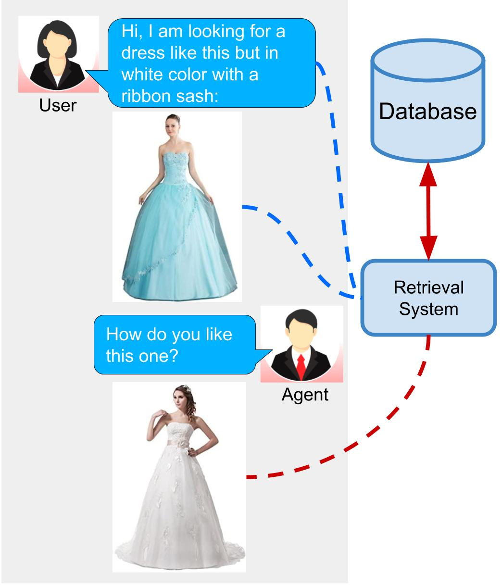
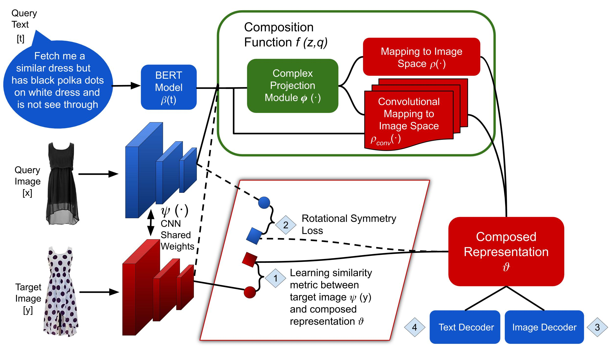

# Compositional Learning of Image-Text Query for Image Retrieval 

## Introduction

In this work, we investigate the problem of retrieving images from a database based on a multi-modal (image-text) query. 
Specifically, the query text prompts some modification in the query image and the task is to retrieve images with the desired modifications. 
## Teaser Figure

For instance, a user of an E-Commerce platform is interested in buying a dress, which should look similar to her friend’s dress, but the dress should be of white color with a ribbon sash. In this case, we would like the algorithm to retrieve some dresses with desired modifications in the query
dress. 

## ComposeAE Architecture 
We propose an autoencoder based model, ComposeAE, to learn the composition of image and text query
for retrieving images. We adopt a deep metric learning approach and learn a metric that pushes composition
of source image and text query closer to the target images. We also propose a rotational symmetry constraint
on the optimization problem. 

## Results
Our approach is able to outperform the state-of-the-art method TIRG on three benchmark datasets, namely: MIT-States, Fashion200k and Fashion IQ. 
In order to ensure fair comparison, we introduce strong baselines by enhancing TIRG method. 

## Code is available.

## Instructions to run will be uploaded soon.
